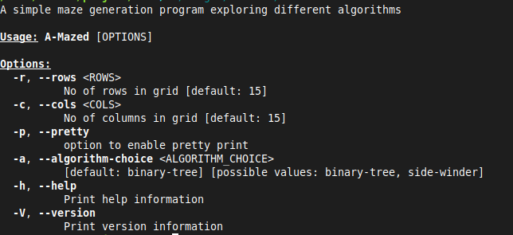
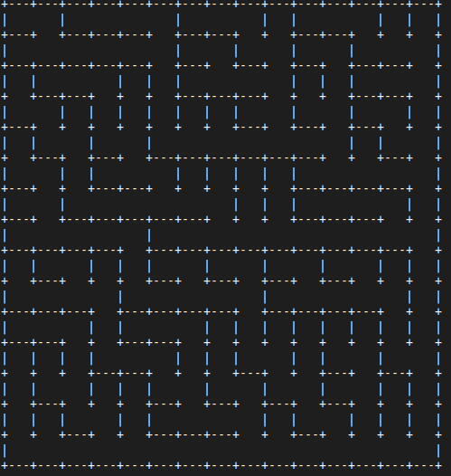
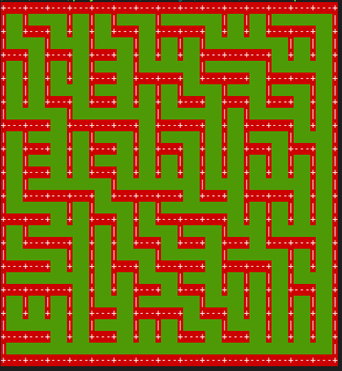
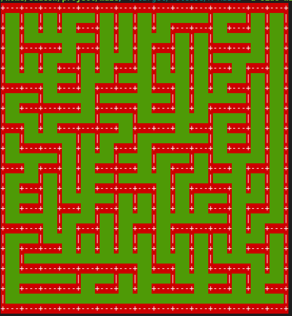

# A-Mazed

App to generate mazes in terminal

## Description

A project I started to explore maze generation algorithms but got turned into me exploring 
useful rust crates like clap, colored. 


### Dependencies

You dont need to download anything explicitely I think. Well you do need to have cargo and rust stuff installed. Also git if you want to git clone. At this point I'm just filling this readme so don't mind me. Anyway here are the crates I used:
1. clap = "4.0.19"
2. rand = "0.8.5"
3. colored = "2.0.0"

### Installing
For now just clone it from github.
```bash
git clone https://github.com/sudeshsubedi/A-Mazed.git
cd A-Mazed
cargo build --release
./target/release/A-Mazed
```


### Executing program

For now (again) go to the project directory and cargo run

For app's arguments and command:
```bash
./target/release/A-Mazed -h
```
This will produce following help message:



## Outputs

Some of the outputs of the app

- A default run of the program:



- Binary Tree - pretty option



- SideWinder - pretty




## Authors

Sudesh Subedi  
[@sudeshsubedi9](https://twitter.com/sudeshsubedi9)

## License

This project is licensed under the MIT License - see the [LICENSE](LICENSE) file for details

## Acknowledgments
Inspiration for the project and resource on algorithms is from the book
[Maze-for-programmers](http://www.mazesforprogrammers.com/) by [Jamis Buck](https://jamisbuck.org/).